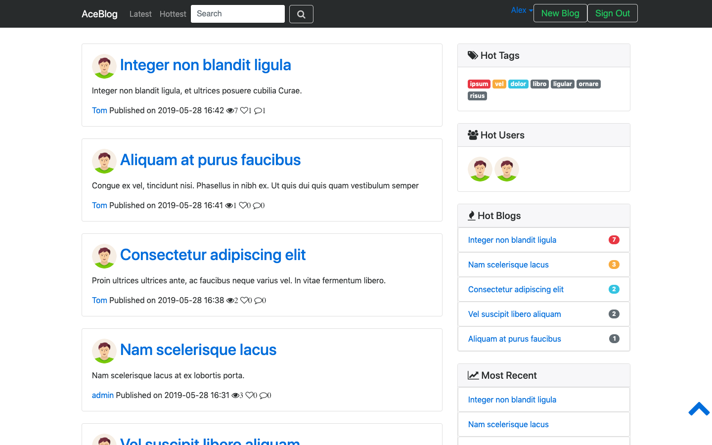
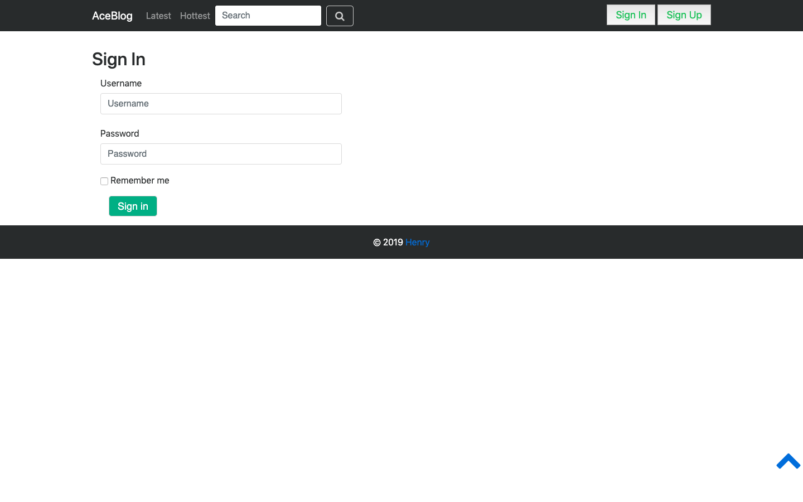
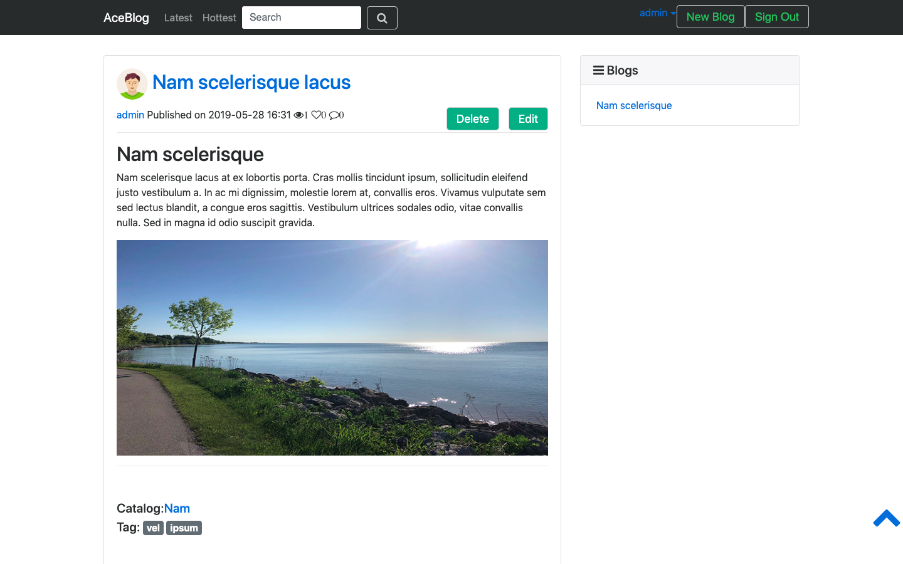
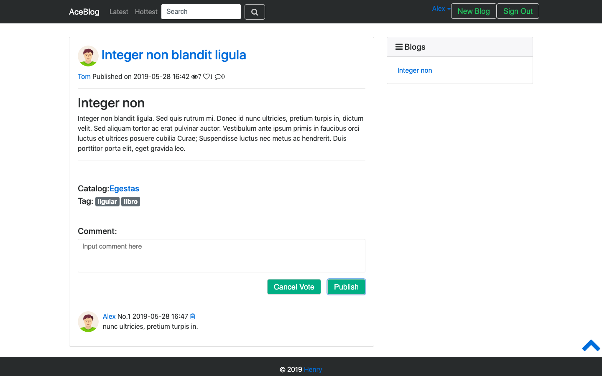
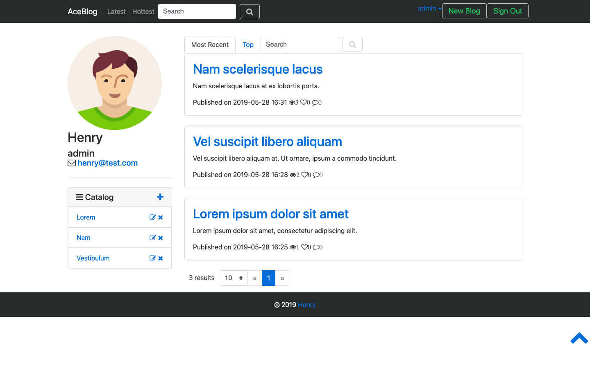
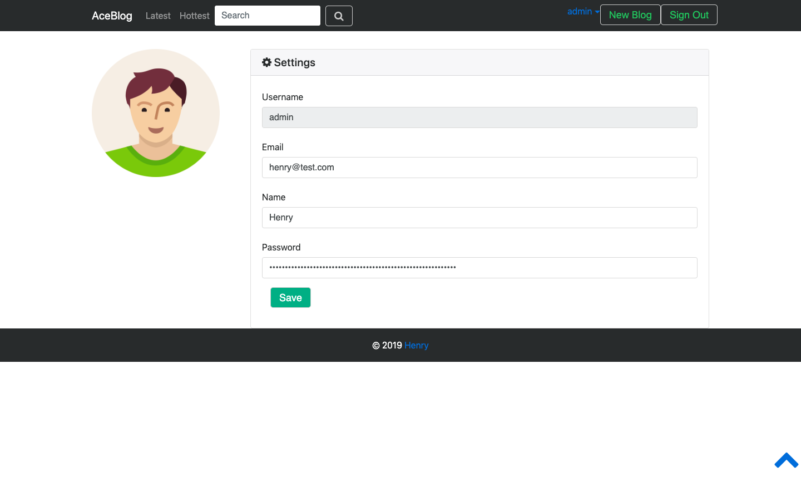
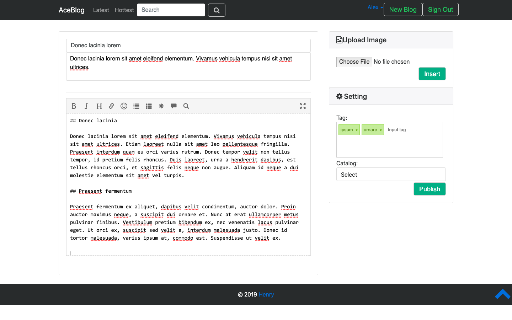
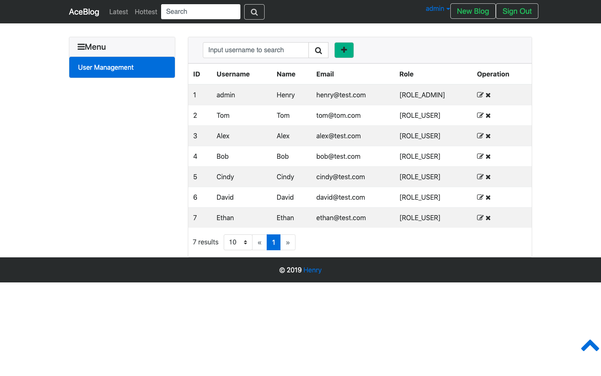
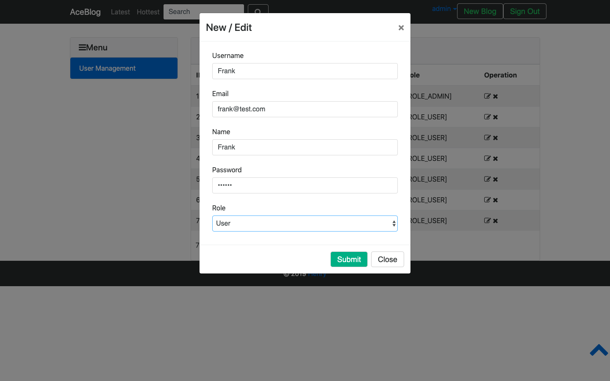

# AceBlog

Aceblog is blog system based on Spring Framework.

- Users with different permissions
- Blog edit with markdown
- Comments and votes
- Tags and catalogs
- Auto recommend popular content
- Full-text search

## Set up instructions

1. Download source code

   ```shell
   $ git clone https://github.com/HER0MA/SpringBlogSystem.git
   ```

2. Download, install and run [MySQL Sever](https://dev.mysql.com/downloads/mysql/5.7.html) (Version 5.7)

3. Download, install and run [Elasticsearch](https://www.elastic.co/cn/downloads/past-releases/elasticsearch-2-4-4) (Version 2.4.4)

4. Download [MongoDB file server](https://github.com/waylau/mongodb-file-server) and run

5. Change to blog root directory and run

   ```shell
   $ ./gradlew bootRun
   ```

## User manual

After running the program, you can visite the website at [http://localhost:8080](http://localhost:8080/). You will be directed to **main page**. In main page, hot tags, hot users, hot blogs are calculated from posted time, number of votes, number of views and number of comments. You can search blogs by keywords in main page.



---

You can **sign in** with you username and password by clicking on sign in button.  There are two users by default: one admin (username: admin, password: 123456) and one user (username: tom, password: 123456).



---

Click on a blog's title, you will be directed to a **blog page**.



---

You add **comment** and **vote** on a blog.



---

After signing in, click on your username and you can view **your profile**. Your blogs and catalogs are listed in your profile page.



---

You can also change **your information** by clicking on setting button in the drop down list.



---

Click on New Blog button, you will be directed to a **blog edit page**. The text editor supports Markdown. You can choose catalog and set tag for a blog.



---

If you are a admin user, you can go to the **user management page**  [http://localhost:8080/admins](http://localhost:8080/admins). In this page, all users are listed.



---

You can **add / edit users**.



## Technologies

- JDK 8
- Gradle
- Spring
- Spring Boot
- Spring MVC
- Spring Data
- Spring Security
- MySQL
- Hibernate
- H2 Database
- Elasticsearch
- Thymeleaf
- JavaScript
- JQuery
- Bootstrap
- Font Awesome
- HTML5
- CSS3

